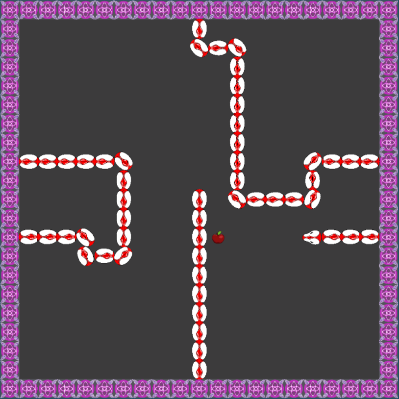

# Snake2D_Custom 🐍

Snake2D_Custom — это простая 2D змейка, созданная на Unity.  
Игра реализована в классическом стиле: управляй змейкой, собирай еду и избегай столкновений с самим собой.  

## Ссылки на игру

- **[Играть на itch.io](https://vash-valeriy.itch.io/snake2d-custom)**
- **[Играть на Unity Play](https://play.unity.com/en/games/53e32bf5-3e23-467a-be89-58e3f5d8be04/snake2d-custom)**

## Скриншоты

## Как играть

- Стрелки или WASD — управление змейкой  
- Цель — собирать еду и расти как можно длиннее  
- Избегай столкновений с телом змейки  

## Технологии

- Unity 6000.2.0f1
- C#  
- 2D Sprite  

## Лицензия

MIT License
